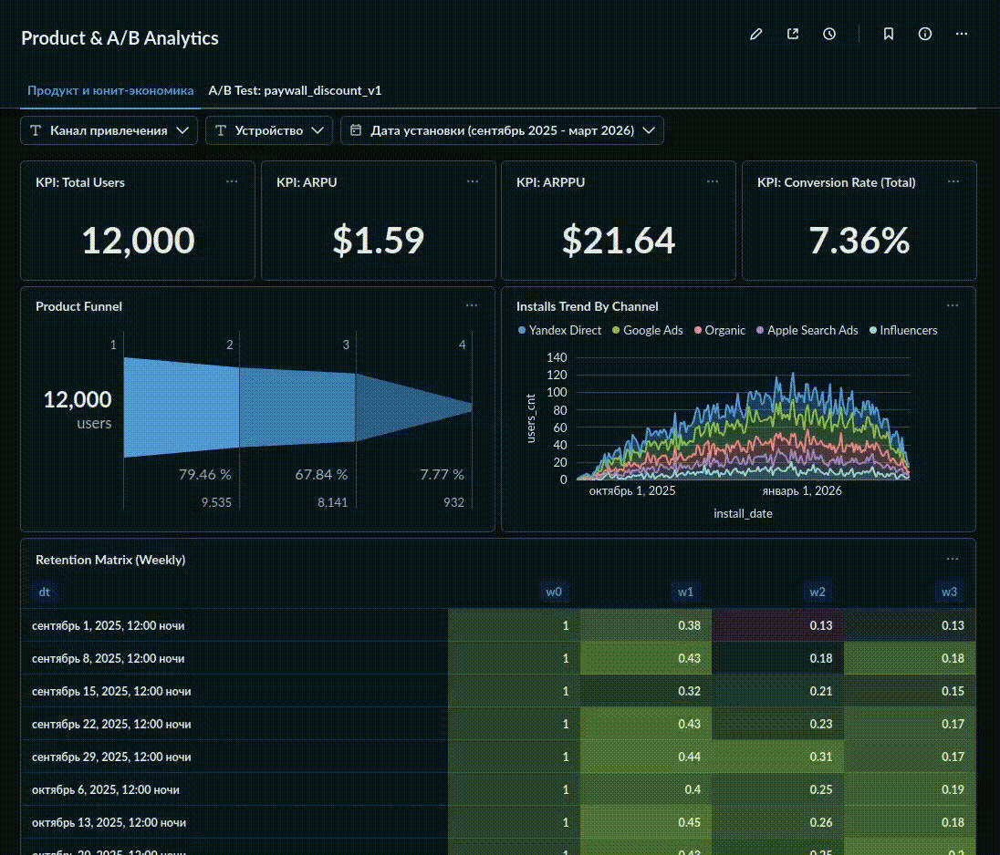
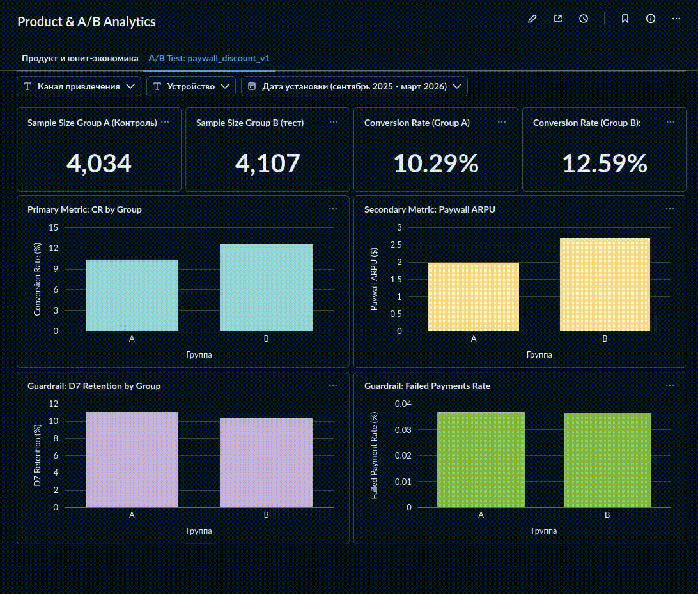

# End-to-End Product & A/B Analytics: Subscription Mobile App

Комплексный проект по продуктовой аналитике подписочного мобильного приложения (фитнес/медитации). Проект охватывает полный цикл работы аналитика: от проектирования схемы БД PostgreSQL и генерации реалистичного датасета до расчета ключевых продуктовых метрик, проведения A/B-тестирования и построения интерактивных дашбордов.

## Структура проекта

```text
.
├── analysis/
│   ├── ab_test.ipynb           # Ноутбук с дизайном, проверкой SRM и статанализом A/B-теста
│   └── metrics.ipynb           # Ноутбук с расчетом продуктовых метрик, воронки и когорт
├── dashboard_demo/
│   ├── dashboard_ab.gif        # Демонстрация дашборда A/B-теста
│   ├── dashboard_ab.mp4
│   ├── dashboard_metrics.gif   # Демонстрация продуктового дашборда
│   └── dashboard_metrics.mp4
├── scripts/
│   ├── generation.py           # Python-скрипт генерации синтетических данных
│   └── tables_creation.sql     # SQL-скрипт создания структуры PostgreSQL
├── .env                        # Конфигурация подключения к БД
├── .gitignore
├── erd.pgerd                   # ER-диаграмма базы данных
└── requirements.txt            # Зависимости Python

```

## База данных и пайплайн данных

Данные генерируются скриптом `scripts/generation.py` и загружаются в PostgreSQL. Схема состоит из 4 реляционных таблиц (`erd.pgerd`):

1. **users**: 12 000 уникальных пользователей за 6 месяцев (сентябрь 2025 — февраль 2026), атрибуты установки (канал, устройство, страна).
2. **events**: ~50 000+ событий продуктовой воронки (`app_first_launch`, `onboarding_complete`, `paywall_view`, `subscription_purchase`, `session_start`).
3. **orders**: ~2 000+ транзакций с типами планов (weekly $4.99, monthly $14.99, annual $49.99), статусами и автопродлениями.
4. **ab_experiments**: Сплитование пользователей в эксперименте `paywall_discount_v1` (группы A и B, 50/50).

## Продуктовые метрики и юнит-экономика

В ходе анализа (`analysis/metrics.ipynb`) были рассчитаны базовые метрики продукта:

* **Продуктовая воронка:**
* First Launch -> Onboarding Complete: 80.1%
* Onboarding Complete -> Paywall View: 84.7%
* Paywall View -> Purchase: 11.6%


* **Юнит-экономика:**
* ARPU: $1.53
* ARPPU: $20.69


* **Retention Rate:**
* Day 1: 17.1% (Churn Rate D1: 82.9%)
* Day 7: 11.4% (Churn Rate D7: 88.6%)
* Day 30: 1.3% (Churn Rate D30: 98.7%)


Также в SQL/Python построена помесячная и понедельная матрица когортного удержания (Retention Matrix).

## Анализ A/B-теста (`paywall_discount_v1`)

* **Гипотеза:** Добавление скидки на первый период на экране подписки (Group B) увеличит конверсию в покупку без ухудшения качества аудитории.
* **Сплитирование (SRM):** Двусторонний Z-тест не выявил SRM ($p > 0.05$), распределение по группам корректное (50/50).
* **Primary Metric (Conversion Rate to Purchase):**
* Control (Group A): 10.29%
* Treatment (Group B): 12.59%
* Абсолютный прирост: +2.30%
* Статистическая значимость: $Z = 3.26$, $p = 0.0011$ (различие статистически значимо).


* **Secondary Metric (ARPU on Paywall Viewers):**
* Выручка на пользователя, усмотревшего paywall, выросла с $1.99 до $2.70. 95%-й доверительный интервал бутстрепа для разницы средних: [$0.36, $1.06].


* **Guardrail Metrics:**
* Retention D7 не снизился относительно контрольной группы.
* Доля ошибок оплаты (`status = 'failed'`) осталась на базовом уровне.


**Итоговое решение:** Эксперимент признан успешным. Рекомендовано выкатить вариант B с обновленным экраном подписки на 100% пользователей.

## Дашборды

### 1. Продуктовый дашборд и юнит-экономика

Визуализация основных KPI, динамики установок по каналам привлечения, шагов воронки конверсии и когортной матрицы удержания.



### 2. Дашборд A/B-тестирования

Мониторинг сплита групп, сравнение ключевой конверсии, доверительных интервалов и ARPU по группам A и B.



## Запуск проекта

1. **Клонирование репозитория и установка зависимостей:**
```bash
git clone <repository_url>
cd <repository_folder>
pip install -r requirements.txt

```


2. **Настройка базы данных:**
Создайте файл `.env` в корне проекта и укажите параметры подключения:
```env
DB_USER=postgres
DB_PASSWORD=your_password
DB_HOST=localhost
DB_PORT=5432
DB_NAME=product_analytics

```


3. **Инициализация БД и генерация данных:**
```bash
psql -U postgres -d product_analytics -f scripts/tables_creation.sql
python scripts/generation.py

```


4. **Запуск ноутбуков:**
```bash
jupyter notebook analysis/

```
